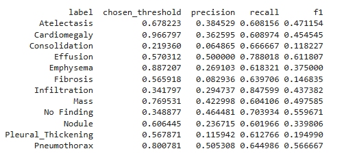

# ChestXray14 Disease Classification

A deep learning-based medical imaging project that classifies **14 thoracic diseases** from chest X-ray images using convolutional neural networks and transfer learning.

---

## Overview

This project uses the **NIH ChestXray14 dataset** to build a multi-label classification model capable of detecting multiple diseases from a single X-ray image.

The pipeline includes:
- Data preprocessing & cleaning
- Handling class imbalance
- Transfer learning with pretrained CNNs
- Model training, evaluation, and optimization

---

## Problem Statement

Chest X-ray diagnosis is time-consuming and requires expert radiologists.  
This project aims to assist in **automated disease detection** using deep learning.

---

## Dataset

- **Dataset:** NIH ChestXray14  
- **Images:** 100,000+ frontal chest X-rays  
- **Labels:** 14 diseases including:
  - Atelectasis  
  - Cardiomegaly  
  - Effusion  
  - Infiltration  
  - Mass  
  - Nodule  
  - Pneumonia  
  - Pneumothorax  
  - Edema  
  - Fibrosis  
  - Pleural Thickening  
  - Hernia  

---

## Tech Stack

- **Language:** Python  
- **Libraries:** PyTorch, NumPy, Pandas, Matplotlib  
- **Models:** CNN, ResNet (Transfer Learning)  
- **Tools:** Jupyter Notebook / Google Colab  

---

## Project Pipeline

1. Data loading & preprocessing  
2. Label encoding for multi-label classification  
3. Train-validation split  
4. Data augmentation  
5. Model building (ResNet-based)  
6. Training with:
   - Early stopping  
   - Learning rate scheduling  
7. Evaluation using relevant metrics  

---

## Model Features

- Multi-label classification (one image → multiple diseases)
- Transfer learning using pretrained ResNet
- Handles class imbalance
- Efficient training on large-scale dataset

---

## Evaluation Metrics

- Accuracy  
- F1 Score  
- AUC-ROC  
- Loss curves  

.png)

---
